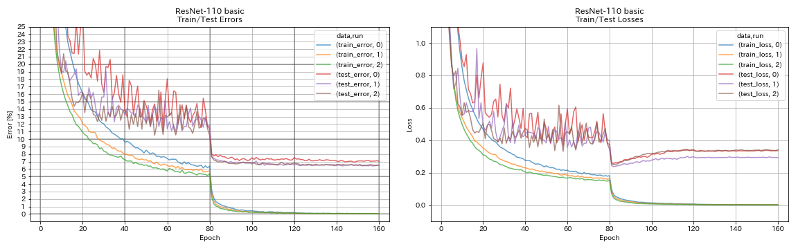
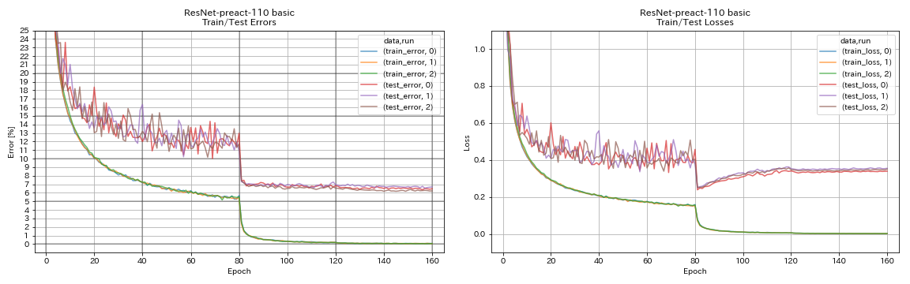
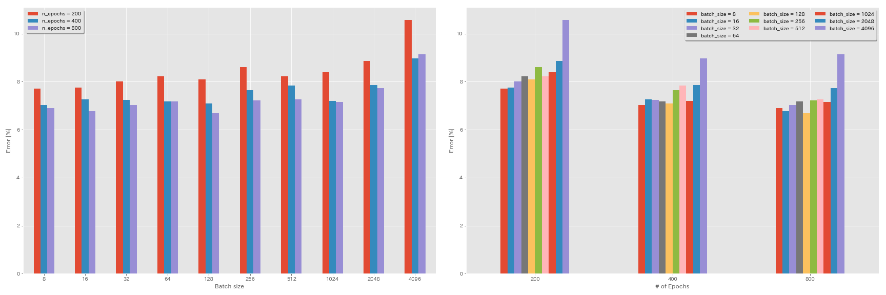
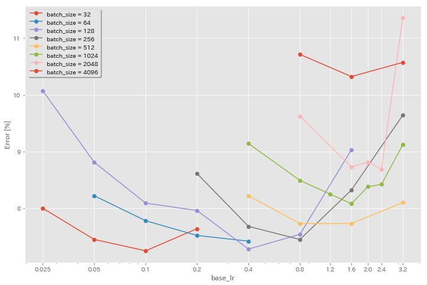

# PyTorch Image Classification

The project is implemented using PyTorch.

## Requirements

* Ubuntu (It's only tested on Ubuntu, so it may not work on Windows.)
* Python >= 3.7
* PyTorch >= 1.4.0
* torchvision
* [NVIDIA Apex](https://github.com/NVIDIA/apex)


## Results on CIFAR-10


| Model                                  | Test Error (median of 3 runs) | Test Error (in paper)                  | Training Time |
|:---------------------------------------|:-----------------------------:|:--------------------------------------:|--------------:|
| ResNet-110                             |           6.52                | 6.43 (best), 6.61 +/- 0.16             |      3h06m    |
| ResNet-preact-110                      |           6.47                | 6.37 (median of 5 runs)                |      3h05m    |


#### ResNet

```bash
python train.py --config configs/cifar/resnet.yaml
```




#### ResNet-preact

```bash
python train.py --config configs/cifar/resnet_preact.yaml \
    train.output_dir experiments/resnet_preact_basic_110/exp00
```




## Experiments

### Experiments on batch size and learning rate

* Following experiments are done on CIFAR-10 dataset.
* Results reported in the table are the test errors at last epochs.

#### Linear scaling rule for learning rate

| Model            | batch size | initial lr | lr schedule | # of Epochs | Test Error (1 run) | Training Time |
|:----------------:|-----------:|:-----------|:-----------:|------------:|:------------------:|--------------:|
| ResNet-preact-20 |    4096    |   3.2      |    cosine   |     200     |        10.57       |       22m     |
| ResNet-preact-20 |    2048    |   1.6      |    cosine   |     200     |         8.87       |       21m     |
| ResNet-preact-20 |    1024    |   0.8      |    cosine   |     200     |         8.40       |       21m     |
| ResNet-preact-20 |     512    |   0.4      |    cosine   |     200     |         8.22       |       20m     |
| ResNet-preact-20 |     256    |   0.2      |    cosine   |     200     |         8.61       |       22m     |
| ResNet-preact-20 |     128    |   0.1      |    cosine   |     200     |         8.09       |       24m     |
| ResNet-preact-20 |      64    |   0.05     |    cosine   |     200     |         8.22       |       28m     |
| ResNet-preact-20 |      32    |   0.025    |    cosine   |     200     |         8.00       |       43m     |
| ResNet-preact-20 |      16    |   0.0125   |    cosine   |     200     |         7.75       |     1h17m     |
| ResNet-preact-20 |       8    |   0.006125 |    cosine   |     200     |         7.70       |     2h32m     |

| Model            | batch size | initial lr | lr schedule | # of Epochs | Test Error (1 run) | Training Time |
|:----------------:|-----------:|:-----------|:-----------:|------------:|:------------------:|--------------:|
| ResNet-preact-20 |    4096    |   3.2      |  multistep  |     200     |        28.97       |       22m     |
| ResNet-preact-20 |    2048    |   1.6      |  multistep  |     200     |         9.07       |       21m     |
| ResNet-preact-20 |    1024    |   0.8      |  multistep  |     200     |         8.62       |       21m     |
| ResNet-preact-20 |     512    |   0.4      |  multistep  |     200     |         8.23       |       20m     |
| ResNet-preact-20 |     256    |   0.2      |  multistep  |     200     |         8.40       |       21m     |
| ResNet-preact-20 |     128    |   0.1      |  multistep  |     200     |         8.28       |       24m     |
| ResNet-preact-20 |      64    |   0.05     |  multistep  |     200     |         8.13       |       28m     |
| ResNet-preact-20 |      32    |   0.025    |  multistep  |     200     |         7.58       |       43m     |
| ResNet-preact-20 |      16    |   0.0125   |  multistep  |     200     |         7.93       |     1h18m     |
| ResNet-preact-20 |       8    |   0.006125 |  multistep  |     200     |         8.31       |     2h34m     |



#### Effect of initial learning rate



| Model            | batch size | initial lr | lr schedule | # of Epochs | Test Error (1 run) | Training Time |
|:----------------:|-----------:|:-----------|:-----------:|------------:|:------------------:|--------------:|
| ResNet-preact-20 |    4096    |   3.2      |    cosine   |     200     |        10.57       |       22m     |
| ResNet-preact-20 |    4096    |   1.6      |    cosine   |     200     |        10.32       |       22m     |
| ResNet-preact-20 |    4096    |   0.8      |    cosine   |     200     |        10.71       |       22m     |

| Model            | batch size | initial lr | lr schedule | # of Epochs | Test Error (1 run) | Training Time |
|:----------------:|-----------:|:-----------|:-----------:|------------:|:------------------:|--------------:|
| ResNet-preact-20 |    2048    |   3.2      |    cosine   |     200     |        11.34       |       21m     |
| ResNet-preact-20 |    2048    |   2.4      |    cosine   |     200     |         8.69       |       21m     |
| ResNet-preact-20 |    2048    |   2.0      |    cosine   |     200     |         8.81       |       21m     |
| ResNet-preact-20 |    2048    |   1.6      |    cosine   |     200     |         8.73       |       22m     |
| ResNet-preact-20 |    2048    |   0.8      |    cosine   |     200     |         9.62       |       21m     |

| Model            | batch size | initial lr | lr schedule | # of Epochs | Test Error (1 run) | Training Time |
|:----------------:|-----------:|:-----------|:-----------:|------------:|:------------------:|--------------:|
| ResNet-preact-20 |    1024    |   3.2      |    cosine   |     200     |         9.12       |       21m     |
| ResNet-preact-20 |    1024    |   2.4      |    cosine   |     200     |         8.42       |       22m     |
| ResNet-preact-20 |    1024    |   2.0      |    cosine   |     200     |         8.38       |       22m     |
| ResNet-preact-20 |    1024    |   1.6      |    cosine   |     200     |         8.07       |       22m     |
| ResNet-preact-20 |    1024    |   1.2      |    cosine   |     200     |         8.25       |       21m     |
| ResNet-preact-20 |    1024    |   0.8      |    cosine   |     200     |         8.08       |       22m     |
| ResNet-preact-20 |    1024    |   0.4      |    cosine   |     200     |         8.49       |       22m     |

| Model            | batch size | initial lr | lr schedule | # of Epochs | Test Error (1 run) | Training Time |
|:----------------:|-----------:|:-----------|:-----------:|------------:|:------------------:|--------------:|
| ResNet-preact-20 |     512    |   3.2      |    cosine   |     200     |         8.51       |       21m     |
| ResNet-preact-20 |     512    |   1.6      |    cosine   |     200     |         7.73       |       20m     |
| ResNet-preact-20 |     512    |   0.8      |    cosine   |     200     |         7.73       |       21m     |
| ResNet-preact-20 |     512    |   0.4      |    cosine   |     200     |         8.22       |       20m     |

| Model            | batch size | initial lr | lr schedule | # of Epochs | Test Error (1 run) | Training Time |
|:----------------:|-----------:|:-----------|:-----------:|------------:|:------------------:|--------------:|
| ResNet-preact-20 |     256    |   3.2      |    cosine   |     200     |         9.64       |       22m     |
| ResNet-preact-20 |     256    |   1.6      |    cosine   |     200     |         8.32       |       22m     |
| ResNet-preact-20 |     256    |   0.8      |    cosine   |     200     |         7.45       |       21m     |
| ResNet-preact-20 |     256    |   0.4      |    cosine   |     200     |         7.68       |       22m     |
| ResNet-preact-20 |     256    |   0.2      |    cosine   |     200     |         8.61       |       22m     |

| Model            | batch size | initial lr | lr schedule | # of Epochs | Test Error (1 run) | Training Time |
|:----------------:|-----------:|:-----------|:-----------:|------------:|:------------------:|--------------:|
| ResNet-preact-20 |     128    |   1.6      |    cosine   |     200     |         9.03       |       24m     |
| ResNet-preact-20 |     128    |   0.8      |    cosine   |     200     |         7.54       |       24m     |
| ResNet-preact-20 |     128    |   0.4      |    cosine   |     200     |         7.28       |       24m     |
| ResNet-preact-20 |     128    |   0.2      |    cosine   |     200     |         7.96       |       24m     |
| ResNet-preact-20 |     128    |   0.1      |    cosine   |     200     |         8.09       |       24m     |
| ResNet-preact-20 |     128    |   0.05     |    cosine   |     200     |         8.81       |       24m     |
| ResNet-preact-20 |     128    |   0.025    |    cosine   |     200     |        10.07       |       24m     |

| Model            | batch size | initial lr | lr schedule | # of Epochs | Test Error (1 run) | Training Time |
|:----------------:|-----------:|:-----------|:-----------:|------------:|:------------------:|--------------:|
| ResNet-preact-20 |      64    |   0.4      |    cosine   |     200     |         7.42       |       35m     |
| ResNet-preact-20 |      64    |   0.2      |    cosine   |     200     |         7.52       |       36m     |
| ResNet-preact-20 |      64    |   0.1      |    cosine   |     200     |         7.78       |       37m     |
| ResNet-preact-20 |      64    |   0.05     |    cosine   |     200     |         8.22       |       28m     |

| Model            | batch size | initial lr | lr schedule | # of Epochs | Test Error (1 run) | Training Time |
|:----------------:|-----------:|:-----------|:-----------:|------------:|:------------------:|--------------:|
| ResNet-preact-20 |      32    |   0.2      |    cosine   |     200     |         7.64       |     1h05m     |
| ResNet-preact-20 |      32    |   0.1      |    cosine   |     200     |         7.25       |     1h08m     |
| ResNet-preact-20 |      32    |   0.05     |    cosine   |     200     |         7.45       |     1h07m     |
| ResNet-preact-20 |      32    |   0.025    |    cosine   |     200     |         8.00       |       43m     |

#### Good learning rate + longer training

| Model            | batch size | initial lr | lr schedule | # of Epochs | Test Error (1 run) | Training Time |
|:----------------:|-----------:|:-----------|:-----------:|------------:|:------------------:|--------------:|
| ResNet-preact-20 |    4096    |   1.6      |    cosine   |     200     |        10.32       |       22m     |
| ResNet-preact-20 |    2048    |   1.6      |    cosine   |     200     |         8.73       |       22m     |
| ResNet-preact-20 |    1024    |   1.6      |    cosine   |     200     |         8.07       |       22m     |
| ResNet-preact-20 |    1024    |   0.8      |    cosine   |     200     |         8.08       |       22m     |
| ResNet-preact-20 |     512    |   1.6      |    cosine   |     200     |         7.73       |       20m     |
| ResNet-preact-20 |     512    |   0.8      |    cosine   |     200     |         7.73       |       21m     |
| ResNet-preact-20 |     256    |   0.8      |    cosine   |     200     |         7.45       |       21m     |
| ResNet-preact-20 |     128    |   0.4      |    cosine   |     200     |         7.28       |       24m     |
| ResNet-preact-20 |     128    |   0.2      |    cosine   |     200     |         7.96       |       24m     |
| ResNet-preact-20 |     128    |   0.1      |    cosine   |     200     |         8.09       |       24m     |

| Model            | batch size | initial lr | lr schedule | # of Epochs | Test Error (1 run) | Training Time |
|:----------------:|-----------:|:-----------|:-----------:|------------:|:------------------:|--------------:|
| ResNet-preact-20 |    4096    |   1.6      |    cosine   |     800     |         8.36       |     1h33m     |
| ResNet-preact-20 |    2048    |   1.6      |    cosine   |     800     |         7.53       |     1h27m     |
| ResNet-preact-20 |    1024    |   1.6      |    cosine   |     800     |         7.30       |     1h30m     |
| ResNet-preact-20 |    1024    |   0.8      |    cosine   |     800     |         7.42       |     1h30m     |
| ResNet-preact-20 |     512    |   1.6      |    cosine   |     800     |         6.69       |     1h26m     |
| ResNet-preact-20 |     512    |   0.8      |    cosine   |     800     |         6.77       |     1h26m     |
| ResNet-preact-20 |     256    |   0.8      |    cosine   |     800     |         6.84       |     1h28m     |
| ResNet-preact-20 |     128    |   0.4      |    cosine   |     800     |         6.86       |     1h35m     |
| ResNet-preact-20 |     128    |   0.2      |    cosine   |     800     |         7.05       |     1h38m     |
| ResNet-preact-20 |     128    |   0.1      |    cosine   |     800     |         6.68       |     1h35m     |

| Model            | batch size | initial lr | lr schedule | # of Epochs | Test Error (1 run) | Training Time |
|:----------------:|-----------:|:-----------|:-----------:|------------:|:------------------:|--------------:|
| ResNet-preact-20 |    4096    |   1.6      |    cosine   |    1600     |         8.25       |     3h10m     |
| ResNet-preact-20 |    2048    |   1.6      |    cosine   |    1600     |         7.34       |     2h50m     |
| ResNet-preact-20 |    1024    |   1.6      |    cosine   |    1600     |         6.94       |     2h52m     |
| ResNet-preact-20 |     512    |   1.6      |    cosine   |    1600     |         6.99       |     2h44m     |
| ResNet-preact-20 |     256    |   0.8      |    cosine   |    1600     |         6.95       |     2h50m     |
| ResNet-preact-20 |     128    |   0.4      |    cosine   |    1600     |         6.64       |     3h09m     |

| Model            | batch size | initial lr | lr schedule | # of Epochs | Test Error (1 run) | Training Time |
|:----------------:|-----------:|:-----------|:-----------:|------------:|:------------------:|--------------:|
| ResNet-preact-20 |    4096    |   1.6      |    cosine   |    3200     |         9.52       |     6h15m     |
| ResNet-preact-20 |    2048    |   1.6      |    cosine   |    3200     |         6.92       |     5h42m     |
| ResNet-preact-20 |    1024    |   1.6      |    cosine   |    3200     |         6.96       |     5h43m     |

| Model            | batch size | initial lr | lr schedule | # of Epochs | Test Error (1 run) | Training Time |
|:----------------:|-----------:|:-----------|:-----------:|------------:|:------------------:|--------------:|
| ResNet-preact-20 |    2048    |   1.6      |    cosine   |    6400     |         7.45       |    11h44m     |
